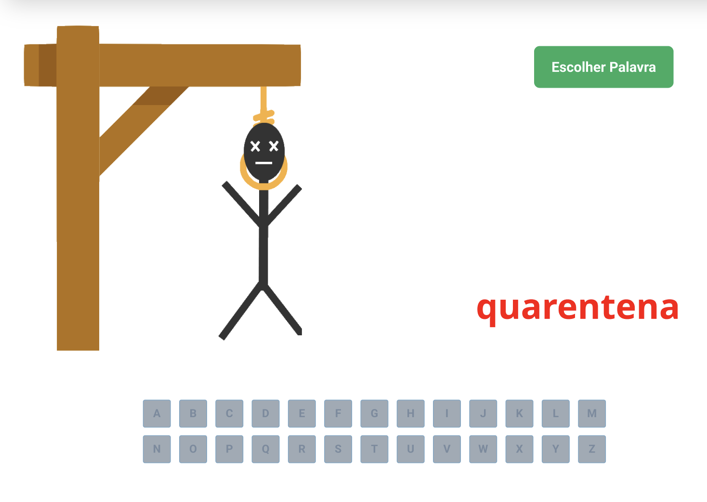

<h1 align="center">Jogo da Forca - ReactJS </h1>

✅ Requisitos
- Geral
    - [ ]  Manipule o HTML usando somente React.
    - [ ]  Você deve criar o projeto com o `create-react-app` padrão, SEM usar nenhum *template*, e delete os arquivos que não serão utilizados.
    - [ ]  O template gerará os arquivos base, incluindo o arquivo `package.json` e `package-lock.json`. Esses arquivos devem estar **sempre** na raiz do repositório no GitHub. Se tiver dentro de uma pasta do repositório, a avaliação vai falhar. Além do bot não aceitar, não é uma boa prática.
    - ✅ **Certo** ⇒ `projeto8-jogoforca` > `package.json`
    - ❌ **Errado** ⇒ `projeto8-jogoforca` > outra pasta > `package.json`
    - [ ]  Seu projeto deverá ser desenvolvido utilizando Git e GitHub.
    - [ ]  A cada requisito implementado faça um *commit* com uma mensagem descritiva do que você evoluiu. Caso queira dividir um requisito em vários *commits*, não há problema. Mas evite colocar mais de um requisito no mesmo *commit.*
    - [ ]  Muito cuidado para não committar a `node_modules`. Se ela estiver committada, a avaliação também falhará. Não é boa prática comittar essa pasta no git.
    - [ ]  Não é permitido o uso de `useEffect`!
- Componentização
    - [ ]  O seu jogo deverá ter 3 componentes:
        - [ ]  `App` (chamará os demais componentes)
        - [ ]  `Jogo` (imagem da forca, botão de iniciar, palavra do jogo)
        - [ ]  `Letras` (conjunto de botões com as letras)
    - 🔥 Dica
        - Mantenha todos os estados da aplicação no `App` e passe seus valores como `props` para os componentes que precisarem!
            
            
            
        
- Pré-jogo
    - [x]  Crie um arquivo chamado `palavras.js` e coloque ele dentro da pasta `src` (o nome e o local precisam ser esses ou a avaliação falhará!).
    - [x]  Dentro do arquivo, insira o array de palavras disponibilizado abaixo:
        - Arquivo de palavras
            
            ```jsx
            const palavras = [
                "abacate", "abacaxi", "abelha", "abanador", "antologia", "amor", "aba", "abrigo", "abrir",
                "banana", "boi", "batata", "bacalhau", "bexiga", "bowl", "batedeira", "bisturi", "barreira", "banco",
                "caixa", "chantilly", "cachorro", "cuidado", "caneta", "carinho", "cabra", "cesto",
                "dados", "dizer", "danone", "dente", "diamante", "diafragma", "detonar", "dia",
                "elefante", "esmeralda", "esfinge", "esfera", "encontro", "ema", "escola", "economia",
                "formiga", "fama", "festa", "fiador", "ferver", "flauta", "figo", "fiapo", "fotografia",
                "goiaba", "gelo", "grito", "guria", "goleiro", "golfinho", "golfe", "girar",
                "harmonia", "haste", "hectare", "hepatite", "hiena", "hidrante",
                "igreja", "importante", "idoso", "irado", "identidade", "idioma", "idade", "idiota",
                "jantar", "jumento", "jararaca", "janela", "jerimum", "jaula", "jabuti", "jaleco",
                "laranja", "lua", "luz", "lindo", "lacraia", "lactose", "lacrar",
                "manga", "morango", "mico", "matar", "mingau", "moqueca", "mocassin",
                "nectarina", "nada", "navio", "namorado", "ninja", "natal", "narciso", "narina", "nabo",
                "ovo", "ostra", "obstetra", "orangotango", "olhar", "ortodoxo", "ouro", "ornamento",
                "pato", "polvo", "povoar", "pano", "princesa", "pizza", "patroa",
                "queijo", "quitanda", "quinta", "quantia", "quarentena", "quadrilha", "quaresma", "quartzo", "quebrar",
                "risada", "rio", "remar", "rato", "racional", "rainha", "radioatividade", "raiz", "raiva", "rachadura",
                "salada", "salamandra", "sacola", "siri", "sabre", "sucarose", "sabedoria", "sacerdote",
                "tatu", "tabacaria", "taberneiro", "torrada", "tamanho", "tatuagem", "trem",
                "uva", "universo", "unanimidade", "ubuntu", "universidade", "urso", "uivar", "unir",
                "vela", "valeta", "vacilo", "valor", "vagem", "vadiagem", "vaca", "valentia", "vidro", "valsa",
                "xadrez", "xilofone", "xarope", "xenofobia", "xereta", "xerife", "xaveco", "xixi", "xale",
                "zebra", "zagueiro", "zero", "zoeira", "zepelim", "zinco", "zumbido"
            ]
            
            export default palavras
            ```
            
        - Esse array possui strings que serão as palavras que o jogador deverá adivinhar. Você deverá importar esse array no componente `App` para utilizá-lo.
        - Você não deve mudar o nome do array nem o export! Mas se quiser mudar o conteúdo para adicionar palavras, fique à vontade! 😄
        - Deixe somente as palavras nesse arquivo. **Não exporte nem implemente mais nada no arquivo** (como uma função para escolher uma palavra, por exemplo), pois o arquivo poderá ser substituído ao longo da avaliação automática.
    - [x]  Os botões de letras devem ser mapeados através de um array do alfabeto:
        - Array do alfabeto
            
            ```jsx
            const alfabeto = ["a", "b", "c", "d", "e", "f", "g", "h", "i", "j", "k", "l", "m", "n", "o", "p", "q", "r", "s", "t", "u", "v", "w", "x", "y", "z"]
            ```
            
    - [x]  Antes de o jogo iniciar, os botões de letras devem estar desabilitados.
        - Os botões desabilitados **devem** possuir o atributo `disabled` no HTML.
- Ao apertar “Escolher Palavra”
    - [x]  Letras passam a ficar habilitadas.
    - [x]  A contagem de erros nesse momento é 0, a imagem da forca vazia é mostrada.
    - [x]  Você deve sortear uma das palavras do array que está no arquivo `palavras.js` para o usuário tentar adivinhar.
    - [x]  Aparece a palavra a ser adivinhada na tela, com um *underline* ( `_` ) para cada letra que a palavra possui.
    - 🔥 Dica
        - Se você transformar a palavra em um array, será muito mais fácil de fazer as operações e comparações que irão acontecer no jogo 😉
- Ao pressionar uma letra
    - [x]  O botão de uma letra já clicada deve ficar desabilitado.
    - [x]  Se a palavra escolhida no jogo tiver a letra que o usuário apertou:
        - [x]  O *underline* da posição correspondente à letra deve ser substituído pela letra em si.
        - [x]  As palavras disponibilizadas não possuem caracteres especiais, então não precisa se preocupar com isso!
    - [x]  Se a palavra escolhida no jogo NÃO tiver a letra que o usuário apertou:
        - [x]  Sua contagem de erros deve aumentar.
        - [x]  A imagem na forca deve mudar (forca0 > forca1 > forca2… e assim sucessivamente).
- Fim de jogo
    - [x]  Botões de letras devem ser desabilitados.
    - [x]  Caso o usuário ganhe:
        - [x]  Quando o usuário ganha, a palavra completa fica em **verde**.
    - [x]  Caso o usuário perca:
        - [x]  A imagem final que deve aparecer é a do boneco enforcado (forca6).
        - [x]  A palavra deve ser revelada, mas em **vermelho**.
    - [x]  Para continuar a jogar, o usuário deve apertar o botão “Escolher Palavra” e o jogo deve ser reiniciado.
- *Deploy*
    - Ao terminar o projeto, você obrigatoriamente deverá realizar o *deploy* utilizando a Vercel.

<hr/>

## 🛠 &nbsp;Skills
<div align="center">
  
  
  
  
          
  
                                     
</div>
<hr/>

## 🚀 &nbsp;Links

- [Figma](https://www.figma.com/file/pBXcqQZlun3INESEf0kwDP/Jogo-da-Forca?node-id=0%3A1).<br/>
- [Deploy](projeto8-jogoforca-akfyhi1t8-curtyraissa.vercel.app).<br/>

<hr/>

## 💬 &nbsp;Contact


Feito por [Raissa Curty](https://github.com/curtyraissa)!

<a href="https://www.linkedin.com/in/raissa-curty/" target="_blank">
    
  </a>&nbsp;
